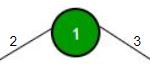
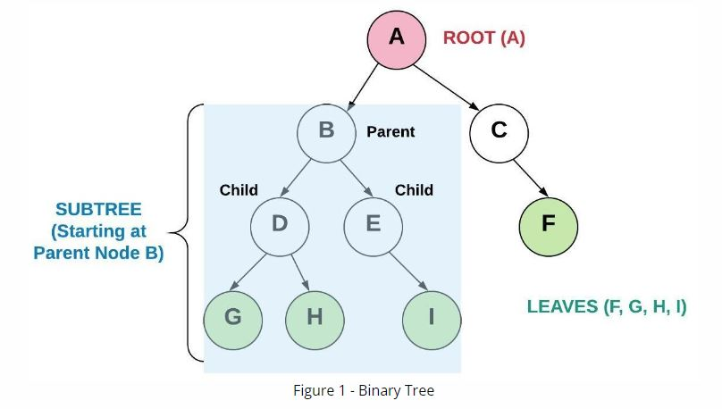
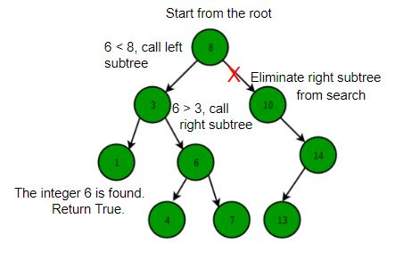
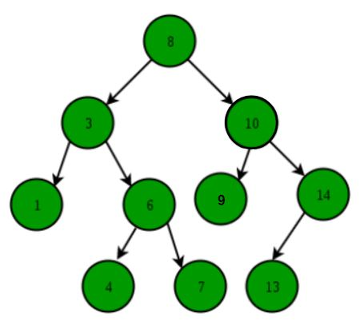
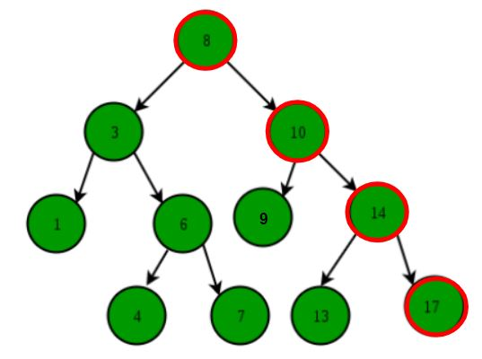
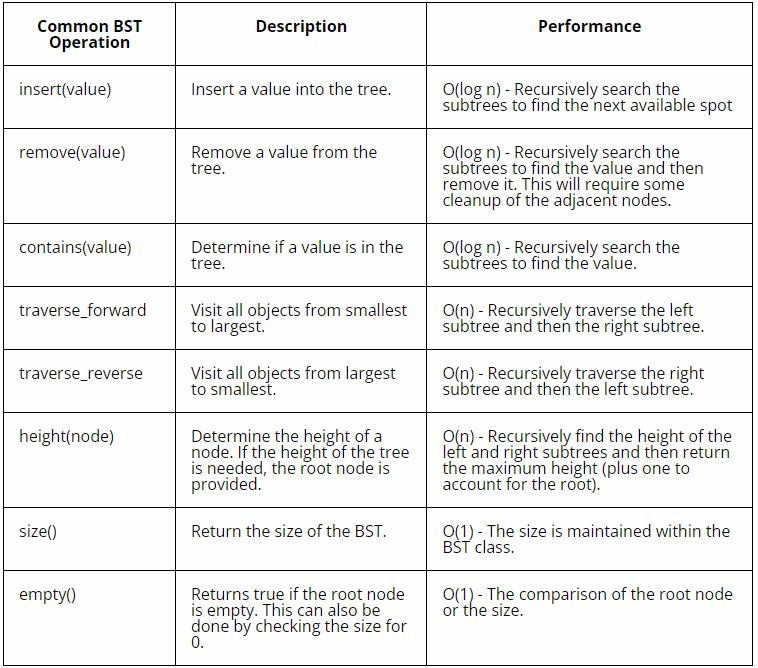
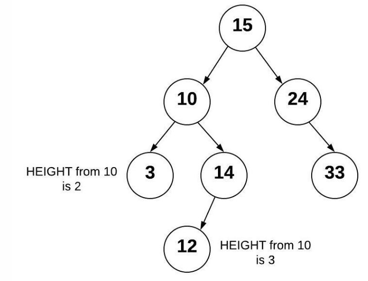

# Binary Search Trees Tutorial
## Introduction
What is a Tree Data Structure?
A tree is a non-linear, hierarchical data structure that is a collection of nodes and pointers. A binary tree has no more than two children for any of its nodes.

### Uses of Binary Tree
Trees are useful when you want to store information that naturally forms a hierarchy. Some applications for binary trees are encoding and decoding operations, evaluating expressions, routing algorithms, fast memory allocation, used to perform quick searches, useful for indexing and storing cache in the system, used in compilers, DOM in HTML, used in spreadsheet software, 


and file explorer.


### Some advantages of Binary Tree:
- Search operation is very fast
- Efficient traversal from parent to child and child to parent.
- Easy to understand and simple to implement
- Have the same structural relationship that is present in the data set
- Data is easily inserted and stored 
- Any number of nodes can be used

### Some disadvantages of Binary Tree:
- Traversal can include many useless null pointers
- Access operation is slower than in an array
- Basic operation can be dependent on height of tree
- Deletion node not easy

## Structure of a Binary Tree
A binary tree node can only have two children, so they are named left and right child. The node contains three parts:



1. Data
2. Pointer to left child
3. Pointer to right child

This node can be represented in Python as a class object, as follows:
```Python
# This class represents an individual node in a Binary Tree
 
class Node:
    def __init__(self, data):
        self.left = None
        self.right = None
        self.val = data
```

### Structural Terms
**trees** - A data structure that starts with a root node and is subsequently connected to multiple nodes according to a relationship between the nodes. The tree does not have any circular loops or unconnected nodes.

**node** - An entry in a tree that contains both the value and pointers to any child nodes.

**binary tree** - A tree that has up to two children for each node.

**parent** - A parent is a node that connects to children nodes.

**child** - A child is a node connected from a parent node.

**root** - The first parent in a tree.

**leaf** - A leaf is a node that has no children.



**subtree** - Subset of a tree made by selecting a node to be the root and including all the children from that node.

**binary search tree** - A binary tree that puts data less than the root to the left and greater than the root to the right. This type of a tree enables searching algorithms to be efficient.

## Binary Search Trees
Binary Search Trees (BTS) have the following rules:
- The left subtree of a node contains only nodes with data less than the node's data.
- The right subtree of a node contains only nodes with data greater than the node's data.
- The left and right subtrees each must also be binary search trees.
- There must be no duplicate nodes. 

This structure provides an order for the trees so that searching may be done very quickly.

### Binary Search Tree with Recursion
To search for data on a binary tree, for example the integer 6:
1. Start at the root
2. Compare the value to be searched with the value of the root.
3. Six is smaller than eight, so we recursively call left subtree. 
4. At each step we go either left or right and at each step we eliminate one of the sub-trees.
5. Six is greater than three, so we recursively call the right subtree.
6. Here we find the search value is equal to the node value. Return True. If no data on the tree matches the search value, then return False.



We could write a function for this search, as follows:
```Python
# This function is used to search for data in BST
def search(root, data):
	
	# If root is null or the data is found at the root
	if root is None or root.val == data:
		return root

	# If the search data is greater than root's data
	if root.val < data:
		return search(root.right, data)

	# If the search data is smaller than root's data
	return search(root.left, data)
```
## Inserting into a Binary Search Tree

Data is always inserted at the leaf. We start searching data from the root until we hit a leaf node. Once a leaf node is found, the new node is added as a child of the leaf node.



Using the tree above, we can determine where to put a new node. 
- Start at the root node and compare the new value with it. 
- Keep comparing until an empty place for the new node is found. 

For example, to insert the value 17:
1. Start at the root node 8 and compare with the new value 17.
2. Since 17 is greater than 8, goto the right and visit node 10.
3. Since 17 is greater than 10, goto the right and visit node 14.
4. Since 17 is greater than 14, goto the right and see there is an empty place.
5. Insert 17 in the empty spot to the right of 14.



Here we have an example in Python code of two functions used to insert
value into the tree. The insert function is called first, and it will then call the recursive _insert function.

As a special case, if the root node is empty (none), then we will put the new node in the root without using any recursion. 

```Python
from logging import root


class BST:
    # This class is to implement a Binary Search Tree

    class Node:
        # Each node has data and links to the left and right sub-tree

        def __init__(self, data):
            # Initialize the node to the data. Links are set to None
            self.data = data
            self.left = None
            self.right = None

    def __init__(self):
        # Initialize an empty BST.
        self.root = None

    def insert(self, data):
        # This function will insert 'data' into the BST.  
        # If the BST is empty, then set the root equal to the new 
        # node.  Otherwise, use _insert to recursively
        # find the location to insert.
        if self.root is None:
            self.root = BST.Node(data)
        else:
            self._insert(data, self.root)  # Start at the root

    def _insert(self, data, node):
        """
        This function will look for a place to insert a node
        with 'data' inside of it.  The current sub-tree is
        represented by 'node'.  This function is intended to be
        called the first time by the insert function.
        """

        if data == node.data:
            return
        elif data < node.data:
            # The data belongs on the left side.
            if node.left is None:
                # We found an empty spot
                node.left = BST.Node(data)
            else:
                # Need to keep looking.  Call _insert
                # recursively on the left sub-tree.
                self._insert(data, node.left)
        else: 
            # The data belongs on the right side.
            if node.right is None:
                # We found an empty spot
                node.right = BST.Node(data)
            else:
                # Need to keep looking.  Call _insert
                # recursively on the right sub-tree.
                self._insert(data, node.right)
  
```

## Traversing a BST
What does it mean to traverse a Binary Search Tree?
**traverse** - The process of visiting all nodes (and subsequently their values) in a tree. Used frequently with a binary search tree using recursion to start at the leaf node that contains the smallest value and going to the leaf node that contains the largest value.

Traversal is a recursive process. It can also be reversed, so that we go from the leaf node that contains the largest value to the leaf node that contains the smallest value. 

The Python code for traversing a BST is similar to the insert and _insert pair of functions, in that we start by calling one function which then calls the associated recursive function. The __contains__ and contains functions will check if data is in the BST. The __iter__ and traverse_forward functions will go from the smallest to largest values. The __reversed__ and traverse_backward functions will go from largest to smallest values.

```Python
    def __contains__(self, data):
        """ 
        Checks if data is in the BST.  This function
        supports the ability to use the 'in' keyword:

        if 5 in my_bst:
            ("5 is in the bst")

        """
        return self._contains(data, self.root)  # Start at the root


    def _contains(self, data, node):
        """
        This funciton will search for a node that contains
        'data'.  The current sub-tree being searched is 
        represented by 'node'.  This function is intended
        to be called the first time by the __contains__ function.
        """
        if data == node.data:
            return True
        # Check if the data is on the left side.
        elif data < node.data: 
            if node.left:
            # We found data
                return self._contains(data, node.left) 


        # Check if the data is on the right side.
        elif data > node.data:
            if node.right:
            # We found data
                return self._contains(data, node.right)

        # If the data is not found, return False
        if node.data is None:
            return False


    def __iter__(self):
        """
        Perform a forward traversal (in order traversal) starting from 
	    the root of the BST.  This is called a generator function.
        This function is called when a loop	is performed:

        for value in my_bst:
            print(value)

        """
        yield from self._traverse_forward(self.root)  # Start at the root
        
    def _traverse_forward(self, node):
        """
        Does a forward traversal (in-order traversal) through the 
        BST.  If the node that we are given (which is the current
        sub-tree) exists, then we will keep traversing on the left
        side (thus getting the smaller numbers first), then we will 
        provide the data in the current node, and finally we will 
        traverse on the right side (thus getting the larger numbers last).

        The use of the 'yield' will allow this function to support loops
        like:

        for value in my_bst:
            print(value)

        The keyword 'yield' will return the value for the 'for' loop to
	    use.  When the 'for' loop wants to get the next value, the code in
	    this function will start back up where the last 'yield' returned a 
	    value.  The keyword 'yield from' is used when our generator function
        needs to call another function for which a `yield` will be called.  
        In other words, the `yield` is delegated by the generator function
        to another function.

        This function is intended to be called the first time by 
        the __iter__ function.
        """
        if node is not None:
            yield from self._traverse_forward(node.left)
            yield node.data
            yield from self._traverse_forward(node.right)
        
    def __reversed__(self):
        """
        Perform a formward traversal (in order traversal) starting from 
        the root of the BST.  This function is called when a the 
        reversed function is called and is frequently used with a for
        loop.

        for value in reversed(my_bst):
            print(value)

        """        
        yield from self._traverse_backward(self.root)  # Start at the root

    def _traverse_backward(self, node):
        """
        Does a backwards traversal (reverse in-order traversal) through the 
        BST.  If the node that we are given (which is the current
        sub-tree) exists, then we will keep traversing on the right
        side (thus getting the larger numbers first), then we will 
        provide the data in the current node, and finally we will 
        traverse on the left side (thus getting the smaller numbers last).

        This function is intended to be called the first time by 
        the __reversed__ function.        
        """
        if node is not None:
            yield from self._traverse_backward(node.right)
            yield node.data
            yield from self._traverse_backward(node.left)
```
## BST in Python

Python does not have a built-in BST class. There are packages available, such as bintrees that utilize binary search tree implementation. We will not be using it in this tutorial, but the following table is included here as a reference. 



### More BST Terms
**height** - The height of a tree can be found by counting the maximum number of nodes between the root and the leaves. 

**balanced** - A tree is balanced if the the height of the tree from the root to each leaf is consistent for all subtrees. The measure of consistentency will vary between algorithms but usually does not exceed a height difference of 1.

**balanced binary search tree** - A binary search tree which is balanced or restructured to be balanced. A balanced binary search tree has O(log n) performance when searching.
### Time Complexity 
The worst-case time complexity of search and insert operations is O(h) where h is the height of the Binary Search Tree. In the worst case, we may have to travel from root to the deepest leaf node. The height of a skewed tree may become n and the time complexity of search and insert operation may become O(n). 
## Example Problem
A balanced binary search tree (balanced BST) is a BST such that the difference of height between any two subtrees is not dramatically different. The example below shows a tree which is balanced because the difference of height between subtrees is less than 2.



The code to find the height must once again be written as a pair of functions. The get-height will call the recursive _get_height function to determine the height of a sub-tree. The task is to use max() to compare the height of the left and right sides and then add 1 to the tallest.

```Python
    def get_height(self):
        """
        Determine the height of the BST.  Note that an empty tree
        will have a height of 0 and a tree with one item (root) will
        have a height of 1.
        
        If the tree is empty, then return 0.  Otherwise, call 
        _get_height on the root which will recursively determine the 
        height of the tree.
        """
        if self.root is None:
            return 0
        else:
            return self._get_height(self.root)  # Start at the root

    def _get_height(self, node):
        """
        Determine the height of the BST.  The height of a sub-tree 
        (represented by 'node') is 1 plus the height of either the 
        left sub-tree or the right sub-tree (whichever one is bigger).

        This function intended to be called the first time by 
        get_height.
        """
        # base case
        if node is None:
            return 0

        #####Solution##############################
        # Step 1. Use recursion to get height of left side
        height_left = self._get_height(node.left)

        # Step 2. Use recursion to get height of right side
        height_right = self._get_height(node.right)

        # Step 3. Use max to determine which is greater height and add 1
        return 1 + max(height_left, height_right) 
        ############################################
```            
## Problem to Solve
In the problem below, the create_bst_from_sorted_list function will create a balanced BST from a sorted list of values, but if we loop through the list of sorted values and add them one at a time using the insert function, the resulting BST would look like a linked list and the time complexity would be O(n) instead of O(log n). 

To accomplish a balanced BST, the _insert_middle function is needed to find the middle of the list and add it to the BST. Then the middle value from the first half, followed by the middle value from the second half, and so forth. This is a recursive process.

After you have solved and tested the problem on your own, click [**here**](bst_solution.py) to see a solution to the problem. You should only look at the solution after you have attempted to solve the problem first.

```Python

def create_bst_from_sorted_list(sorted_list):
    """
    Given a sorted list, create a balanced BST.  
    To get a balanced BST, the _insert_middle function is called to 
    find the middle item in the list to add first to the BST.  The 
    _insert_middle function takes the whole list but also takes a 
    range (first to last) to consider.  For the first call, the full 
    range of 0 to len()-1 used.
    """
    bst = BST()  # Create an empty BST to start with 
    _insert_middle(sorted_list, 0, len(sorted_list)-1, bst)
    return bst

def _insert_middle(sorted_list, first, last, bst):
    """
    This function will insert the item in the middle
    of the sorted list into the binary search tree.  The middle is 
    determined by using indicies represented by 'first' and 'last'.
    For example, if the function was called on:

    sorted_list = [10, 20, 30, 40, 50, 60]
    first = 0
    last = 5

    then the value 30 (index 2 which is the middle) would be added 
    to the 'bst' (the insert function above can be used to do this).   

    Subsequent recursive calls are made to insert the middle from the values before 30 and the values after 30.  If done correctly, the order
    in which values are added (which results in a balanced bst) will be:

    30, 10, 20, 50, 40, 60

    This function is intended to be called the first time by 
    create_bst_from_sorted_list.

    The purpose for having the first and last parameters is so that we do 
    not need to create new sublists when we make recursive calls.  Avoid 
    using list slicing to create sublists to solve this problem.
    """
    # Write your code here #
    

print("\n=========== TESTS FOR PROBLEM TO SOLVE ===========")
tree1 = create_bst_from_sorted_list([10, 20, 30, 40, 50, 60])
tree2 = create_bst_from_sorted_list([x for x in range(127)]) # 2^7 - 1 nodes
tree3 = create_bst_from_sorted_list([x for x in range(128)]) # 2^7 nodes
tree4 = create_bst_from_sorted_list([42])
tree5 = create_bst_from_sorted_list([])
print(tree1.get_height()) # 3
print(tree2.get_height()) # 7 .. any higher and its not balanced
print(tree3.get_height()) # 8 .. any higher and its not balanced
print(tree4.get_height()) # 1
print(tree5.get_height()) # 0
```

## Resources

The following resources were helpful in creating this tutorial:

[BYUI - CSE 212 Lesson 7](https://byui-cse.github.io/cse212-course/lesson09/09-prepare.html)

[youtube.com - "Data Structures Easy to Advanced Course" by William Fiset](https://www.youtube.com/watch?v=RBSGKlAvoiM)

[geeksforgeeks.org - Stack | Set 3 (Reverse a string using stack)](https://www.geeksforgeeks.org/binary-search-tree-data-structure/?ref=lbp)