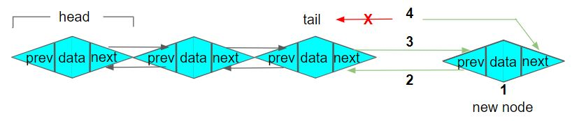
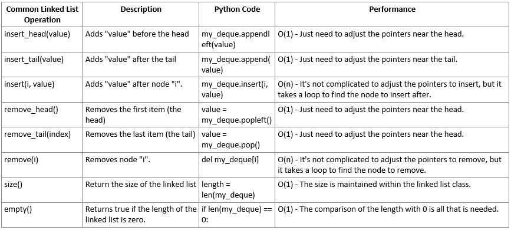

# Linked Lists Tutorial

## Introduction

A linked list is a data structure made up of nodes that contain data which are stored in a random, non-contiguous way. To connect the nodes as a list, each node has a link that points to the next node on the list, which also contains data and a pointer link.


### Comparing Dynamic Array and Linked List

- Linked lists are dynamic without fixed size limitations.

- As we can see on the following table, both linked lists and dynamic arrays can insert or delete from the back end with contant time efficiency. Both require linear time to insert or delete in the middle.


The difference is that a linked list can insert nodes at the front with constant time efficiency, while dynamic arrays are linear when inserting to the front, because they need to shift all existing elements.

### Disadvantages of Linked Lists

- Elements must be accessed sequentially starting from the first node.

- Pointers take up extra space in memory. Space complexity is O(n).

### Uses for Linked Lists

- Linked lists are useful for implementing stacks and queues.
- In the implementation of graphs, linked lists are used to store adjacent vertices.
- For dynamic memory allocation, we use linked lists of free blocks.
- Linked lists are used to maintain directories.
- Circular linked lists are used to cycle through multiple elements on a linked list.
- Some examples where linked lists are used in software:

  - Next and previous buttons in an image viewer

    

  - The back and next buttons on a browser

    

  - Accessing songs in a music player on continuous play

    

## Structure of a Linked List

A node in a list has two parts:


1. A data item that can be an integer, a string, or any type of data.
2. A Pointer or reference to the next node, or an address of another node that it connects to.


The first node is called the head. If the linked list is empty, than the value of the head points to NULL. If the linked list contains data, you can traverse the linked list by following the pointers.

In Python, a linked list can be a class and a Node can be a separate class. The LinkedList class contains a reference of Node class type.

### Example 1

```Python
# LinkedList class
class LinkedList:

  # This function intializes the LinkedList object.
  def __init__(self):
    self.head = None

  # This function traverses the linked list and prints the data, starting with the head
  def printLinkedList(self):
    pll = self.head
    while (pll):
      print(pll.data)
      pll = pll.next


class Node:
  # This function initalizes the Node object.
  def __init__(self, data):
    self.data = data # The node will contain data
    self.next = None # The pointer to next is initialized as null.


# We will begin by creating a linked list with three nodes.

# Begin to execute code:
if __name__=='__main__':

  # Assign an empty linked list
  newlist = LinkedList()

  # Create the nodes
  newlist.head = Node(1)
  newlist.n2 = Node(2)
  newlist.n3 = Node(3)

  # Link the first two nodes by setting the pointer on the head, which is called "next,"" to point to node 2 (n2)
  newlist.head.next = newlist.n2

  # Link the next two nodes
  newlist.n2.next = newlist.n3

  newlist.printLinkedList()

  Output:
  1 2 3
```

We have created a singly linked list with three nodes. In the implementation, we always have a reference to the head and a reference to the tail for quick addition and removal of those nodes.


## Doubly Linked Lists

Now we will look at doubly linked lists. Each node on a doubly linked list contains data and a reference to the next and previous nodes.


In the implementation, we always have a reference to the head and a reference to the tail for quick addition and removal of those nodes from both ends of the doubly linked list.


Singly linked lists are useful because they are simpler to implement and they use less memory than doubly linked lists, but we cannot easily access previous nodes.

Doubly linked lists take twice as much memory as singly linked lists, but they can be traversed both forward and backward which makes them even more useful.

## Inserting into a Doubly Linked List

There are three ways to insert a node into a linked list: insert at the head, insert at the tail, and insert at the middle.

### Inserting at the Head:

1. Create the new node.
2. Set the "next" of the new node to the current head.
3. Set the "prev" the current head to the new node.
4. Set the head equal to the new node.


### Inserting at the Tail:

1. Create the new node.
2. Set the "prev" of the new node to the current tail.
3. Set the "next" the current tail to the new node.
4. Set the tail equal to the new node.



### Note:

In the event that the current head or the tail is empty when inserting a new node, then set both the head and the tail to the new node.

### Accessing from a Linked List:

Before we can insert or remove nodes at the middle of a linked list, we must loop through the linked list to find a specific node or value. Either start at the head to traverse forward, or start at the tail to traverse backward through the list.

1. Start at the end (current = self.head OR current = self.tail)
2. Loop until we have reaced the other end (while current is not None)
3. Follow the pointers to the next node (current = current next)

### Inserting at the Middle:

(Inserting after the node "current")

1. Create a new node
2. Set the "prev" of the new node to the current node
3. Set the "next" of the new node to the next node after current
4. Set the "prev" of the "next" node after current to the new node
5. Set the next of the current node to the new node


### Example 2

```Python
# LinkedList class
class LinkedList:

    class Node:
      # This function initializes the node object
        def __init__(self, data):
            self.data = data # The node will contain data
            self.next = None # The pointer to next is initialized as null.
            self.prev = None # The pointer to prev is initialized as null.

    def __init__(self):
        # This function initializes an empty linked list.
        self.head = None
        self.tail = None
    def insert_head(self, value):
        # This function will insert a new node at the head of the linked list.
        # Create the new node
        new_node = LinkedList.Node(value)

        # If the list is empty, then point both head and tail
        # to the new node.
        if self.head is None:
            self.head = new_node
            self.tail = new_node
        # If the list is not empty, then only connect self.head
        else:
            new_node.next = self.head # Connect new node to the previous head
            self.head.prev = new_node # Connect the previous head to the new node
            self.head = new_node      # Set the head to equal the new node

    def insert_tail(self, value):
        # Insert a new node at the tail end of the
        linked list.

        # Create the new node
        new_node = LinkedList.Node(value)

        # If the list is empty, then point both tail and tail
        # to the new node.
        if self.tail is None:
            self.head = new_node
            self.tail = new_node
        # If the list is not empty, then only connect self.tail
        else:
            new_node.prev = self.tail # Connect the previous tail to the new node
            self.tail.next = new_node # Connect new node to the previous tail
            self.tail = new_node      # Update the tail to point to the new node


    def insert_after(self, value, new_value):
        # This function will insert into the middle of a linked list by adding a
        # 'new_value' after the first occurance of 'value' in the linked list.

        # Search for the node that matches 'value' by starting at the
        # head of the list.
        curr = self.head
        while curr is not None:
            if curr.data == value:
                # If the location of 'value' is at the end of the list,
                # then we can call insert_tail to add 'new_value'
                if curr == self.tail:
                    self.insert_tail(new_value)
                # For any other location of 'value', we need to create a
                # new node and reconnect the links to insert.
                else:
                    new_node = LinkedList.Node(new_value)
                    new_node.prev = curr       # Connect new node to the node containing 'value'
                    new_node.next = curr.next  # Connect new node to the node after 'value'
                    curr.next.prev = new_node  # Connect node after 'value' to the new node
                    curr.next = new_node       # Connect the node containing 'value' to the new node
                return # We can exit the function after we insert
            curr = curr.next # Go to the next node to search for 'value'
```

## Removing from a Doubly Linked List

### Removing the Head Node:

1. Set the "prev" of the second node to None.
2. Set the head to be the second node.


### Removing the Tail Node:

1. Set the "next" of the second to last node to None.
2. Set the tail to be the second to last node.


### Removing a Current Node from the Middle:

1. Set the prev of the node after current to the node before current
2. Set the next of the node before current to the node after current


## Example 3

```Python
    # Continuing from inside the LinkedList class we started in Example 2:
    def remove_head(self):
        # This function will remove the head from the linked list

        # If the list has only one item in it, then set head and tail
        # to None resulting in an empty list.  This condition will also
        # cover an empty list.  Its okay to set to None again.
        if self.head == self.tail:
            self.head = None
            self.tail = None
        # If the list has more than one item in it, then only self.head
        # will be affected.
        elif self.head is not None:
            self.head.next.prev = None  # Disconnect the second node from the first node
            self.head = self.head.next  # Update the head to point to the second node

    def remove_tail(self):
        # This function will remove the tail end from the linked list.
        """
        # If the list has only one item in it, then set head and tail
        # to None resulting in an empty list.  This condition will also
        # cover an empty list.  Its okay to set to None again.
        if self.head == self.tail:
            self.head = None
            self.tail = None
        # If the list has more than one item in it, then only self.tail
        # will be affected.
        elif self.head is not None:
            self.tail.prev.next = None  # Set the "next" of the second to last node to nothing
            self.tail = self.tail.prev  # Set the tail to be the second to last node

    def remove(self, value):
        # This function will remove the first node that contains 'value'.

        # Search for the node that matches 'value' by starting at the
        # head of the list.
        curr = self.head
        # Loop until we have reached the end (None)
        while curr is not None:
            if curr.data == value:
                if curr == self.head:
                    self.remove_head()
                    return
                elif curr == self.tail:
                    self.remove_tail()
                    return
                else:
                    # Set the prev of the node after curr to the node before curr
                    curr.next.prev = curr.prev
                    # Set the next of the node before curr to the node after curr
                    curr.prev.next = curr.next
                    curr = None
                    return
            # Follow the pointer to the next node
            curr = curr.next
        # if value was not present in linked list
        if(curr == None):
            return
```

## Linked Lists in Python

Python has a built-in linked list available called deque. We will not be using it in this tutorial, but the following table is included here as a reference. You will need an import statement: **import deque**. To create an empty linked list: **link_list=deque()**.



## Key Terms

**doubly-linked list** - A linked list that is bi-directional. The linked list will maintain both a head and a tail. To traverse in either direction, the node will have both a pointer to the next node and the previous node. Access to both the head and tail is O(1).

**head** - A pointer to the first node in the linked list.

**linked list** - A data structure that keeps data in order but is not in contiguous memory. To get to the next (or previous) item in the list, pointers are maintained and followed. Access to the head is O(1).

**next** - A pointer in each node of the linked list that points to the next node.

**node** - The combination of the value and the pointers representing one item in the linked list.

**pointer** - Refers to an address in the computer memory. Also called a reference.

**tail** - A pointer to the last node in the linked list. If the list has only one item, then the head and tail are the same.

**value** - The actual data stored in the linked list as part of the node.

**previous** - A pointer in each of the linked list nodes that points to the previous node.

## Example Problem

Implement the **replace** function in the LinkedList class. This function is very similar to the remove function seen above. The function should search for all nodes that are equal to 'old_value' and then replace the value in those nodes with 'new_value'. Unlike the remove function, this function should continue searching through the list to replace all values that match 'old_value'. You will need to write code to test your solution.

```Python
    # We continue working from inside the LinkedList class we started in Example 2.
    #This function will search for all nodes that are equal to 'old_value' and replace them with 'new_value'
    def replace(self, old_value, new_value):
        """
        Search for all instances of 'old_value' and replace the value
        to 'new_value'.
        """
        # Search for the node that matches 'old_value' by starting at the
        # head of the list.
        curr = self.head
        # Loop until we have reached the end (None)
        while curr is not None:
            # Replace the current value in the node with the new value
            if curr.data == old_value:
                curr.data = new_value
            else:
                # Follow the pointer to the next node
                curr = curr.next
    def __str__(self):
        # This function will assist us in testing our code by returning a string representation of the linked list.
        output = "linkedlist["
        first = True
        for value in self:
            if first:
                first = False
            else:
                output += ", "
            output += str(value)
        output += "]"
        return output

# Sample test cases for the Example Problem as "linkedlist[expected results]":
ll = LinkedList()
ll.insert_tail(1)
ll.insert_head(2)
ll.insert_head(2)
ll.insert_head(2)
ll.insert_head(3)
ll.insert_head(4)
ll.insert_head(5)
print(ll) # linkedlist[5, 4, 3, 2, 2, 2, 1]
ll.replace(1, 2)
print(ll) # linkedlist[5, 4, 3, 2, 2, 2, 2]
ll.replace(2, 1)
print(ll) # linkedlist[5, 4, 3, 1, 1, 1, 1]
```

## Problem to Solve

The **iter** function provides the ability to iterate forward through a LinkedList object using a for loop such as for item in my_linkedlist. When a for loop starts, the **iter** function will start. Each time the yield statement runs, it will provide a new value to the for loop and pause the **iter** function. When the for loop goes to the next iteration, it will continue running the **iter** function again until it gets to the next yield which will provide the next value to the for loop. You can use the following test code to see how the **iter** function works:

```Python
for item in my_linkedlist:
  print(item)
```

**Practice Problem**: The **reversed** function is used to iterate backwards. Implement the **reversed** function in the LinkedList class. Hint: Pattern your solution after the **iter** function that was already written for you and that was described above.

```Python
# Practice Problem:

    def __iter__(self):
        # This function will iterate forward through a linked list.
        curr = self.head  # Start at the begining to go forward
        while curr is not None:
            yield curr.data  # Provide (yield) each item to the user
            curr = curr.next # Go forward in the linked list

    def __reversed__(self):
        # This function will iterate backward through a linked list

        # Write your code here.


# To test the __reversed__ function, you can use the following code:
for item in reversed(my_linkedlist):
  print(item)
# Another option:
print(list(reversed(my_linkedlist)))
```

After you have solved and tested the problem on your own, click [**here**](linked_list.py) to see a solution to the problem. You should only look at the solution after you have attempted to solve the problem first.

## Resources

The following resources were helpful in creating this tutorial:

[BYUI - CSE 212 Lesson 7](https://byui-cse.github.io/cse212-course/lesson07/07-prepare.html)

[youtube.com - "Data Structures Easy to Advanced Course" by William Fiset](https://www.youtube.com/watch?v=RBSGKlAvoiM)

[geeksforgeeks.org - Stack | Set 3 (Reverse a string using stack)](https://www.geeksforgeeks.org/linked-list-set-1-introduction/)
