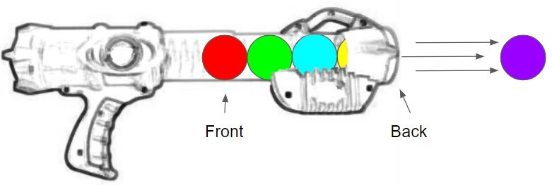
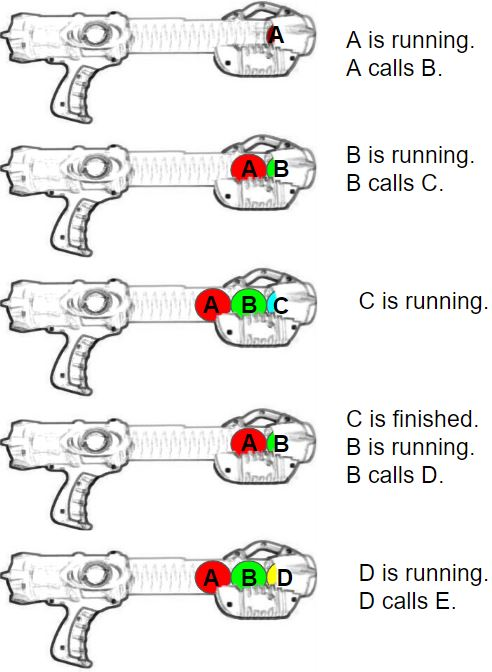

# Stacks Tutorial

## Introduction

A stack is often referred to by the term "Last In, First Out" (LIFO). This describes the order in which items are added to the stack and removed from the stack.

- Stacks are used everywhere in programming. 
- Stacks can be used to model a pile of books, plates, cards, or anything that can be stacked. 
- They are used in compiler syntax checking for matching brackets and braces.
- Stacks are useful for tasks that involve keeping a history and remembering the order items are added or removed. 
- Stacks are less efficient for tasks that involve searching for a specific item in the middle of the stack.
- In Python, stacks can be implemented using a list.

## Structure of a Stack

A stack is a LIFO data structure, so new items are always added to the end of the stack. We can think of this as a push operation. When we delete items from the stack we always remove it from end of the stack. We call this a pop operation.

To visualize the stack, imagine a toy that blasts foam balls from a container using a spring mechanism and air compression.


To load the toy, a ball must be pushed into the cup shaped opening at the end of the toy, where it is held in place with a rubber gasket.  


To remove a ball from the toy, the tube is quickly pulled in toward the user, causing the last ball to blast out with a loud "pop."



When we are loading this toy, we might say we are pushing balls into the front-end, but since we are illustrating Python with stacks, we say that balls are pushed onto the back of the stack. The red ball is at the front of the stack, because it was the first ball in. In python, we always push or pop from the back of the stack. We cannot remove a ball from the middle of the stack.
The real strength of the stack structure is the ability to remember what order items are placed in the stack.

## The "UNDO" Option and the Stack

We are all familiar with the "undo" option in word processors and editors. When we type a letter we see it displayed on the screen, but the letter is also added to back of the stack. When we press "undo," the last item is popped from the stack, and the last letter typed is removed from the screen. The stack holds items in order, and so pressing "undo" will remove them in reverse order. This means that stacks can be useful when we need to perform an operation backwards.

## Software and the Function Stack

Suppose we have the following flow chart, showing where functions will be called in a software program.
We can again use our blaster toy to illustrate what this function stack would look like by using balls to represent our functions.


We will demonstrate how stack data structure is used to support **recursion** by keeping track of previous function calls.
The current function running is always on the back of the stack.



When the function finishes, it is popped off the stack. The result is that the function to return to is the one that is on the back of the stack. 


Python error messages often show which functions have been called up to the point of error. The information comes from the function stack.


Debuggers also use the function stack to help the developer to traverse through the "call stack," one step at a time.


## Implementation of Stacks in Python

Stacks in Python are implemented using lists. There are four common stack operations:
push(value), pop(), size(), and empty(). A peek() operation may also be used. Searching stacks is less efficient than other data structures and so it is not a common operation.


## Key Terms

- **back** - Refers to the location in a stack where a push and pop occurs. The last item put into the stack is found in the back.
- **front** - Refers to the location in a stack where the first item added to the stack can be found. Traditionally, this is index 0 of a dynamic array.
- **pop** - The operation to remove the last item pushed to the stack. The item from the back of the stack is removed and returned.
- **push** - The operation to add a new item onto the stack. The item is placed at the back of the stack.
- **stack** - A data structure that follows a Last In, First Out (LIFO) rule. The stack is used to reverse data or remember previous data including previous results.

# Example Code Using Stacks

In this example, we reverse a string using stacks. For example “Racecar” will be reversed to “racecaR”.

For this program, we will do the following: 

1) Create an empty stack.
2) Push each character from the string to the stack, one at a time.
3) Pop each character from the stack and put it back to string, one at a time.

```Python 
# Function to create an empty stack.
# Initialize size of the stack as 0
def createStack():
    stack=[]
    return stack
 
# Function to determine the size of the stack
def size(stack):
    return len(stack)
 
# Stack is empty if the size is 0
def isEmpty(stack):
    if size(stack) == 0:
        return True
 
# Function to add an item to stack .
# It increases size by 1
def push(stack,item):
    stack.append(item)

# Function to return the value of the item at the back of the stack.
def peek_stack(stack):
    if stack:
        return stack[-1]    # this will get the last element of stack
    else:
        return None
 
# Function to remove an item from stack.
# It decreases size by 1
def pop(stack):
    if isEmpty(stack): 
      return
    return stack.pop()
 
# A stack based function to reverse a string
def reverse(string):
    n = len(string)
     
    # Create a empty stack
    stack = createStack()
 
    # Push all characters of string to stack
    for i in range(0,n,1):
        push(stack,string[i])
 
    # Making the string empty since all
    #characters are saved in stack
    string=""
 
    # Pop all characters of string and
    # put them back to string
    for i in range(0,n,1):
        string+=pop(stack)
         
    return string
     
################################
#TEST 1
################################
string = "1 2 3 4 5 6 7"
string = reverse(string)
print("\nTest 1: Reversed string is " + string)
# Expected result: "Test 1: Reversed string is 7 6 5 4 3 2 1"

################################
#TEST 2
################################
string="wow mom civic racecar minim level radar rotator rotavator reverse"
string = reverse(string)
print("\nTest 2: Reversed string is " + string)
# Expected result:"Test 2: Reversed string is esrever rotavator rotator radar level minim racecar civic mom wow"

################################
#TEST 3
################################
string = "1 @ tenet & 3 + 4 = 7"
string = reverse(string)
print("\nTest 3: Reversed string is " + string)
# Expected result: "Test 3: Reversed string is 7 = 4 + 3 & tenet @ 1"
```

# Practice Exercise: Hi Lo Game

In this exercise we will practice the use stacks to predict the winner of a simple card game with two players. The players use a deck of 36 cards. Each card has a number between 1 and 9. There are 4 sets of each number in the deck. In the game Player1 and Player2 are each presented with identical stacks of seven cards. 

For each round of the game, each player selects a card and shows it to the other player. The value of the two cards are compared. If the value is the same for both players, then both players remove their cards from their stacks and discard them. Otherwise, the player with the lower value card removes the card from their stack and discards it. The player with the higher value card keeps the card on their stack, and the round ends. The higer card will be selected again in the next round, and will continue to be selected until the other player runs out of cards or selects a card with an equal or higher value. The game ends when a player runs out of cards, and the other player is declared the winner.

Our program will take into account the differing strategies of the two players: Player1 selects cards from the top of their stack of cards. Player2 selects cards from the bottom of their stack of cards. Write the program to simulate these two strategies. Keep in mind that we are practising use of the stacks data structure functions only (no slice, dequeue or linked list functions). We will have to use our stack functions to assure that the correct card will be located at the back of the stack when the player shows their card. 

The program should do the following:

1) Create an empty stack for Player1.
2) One by one push all characters of string to Player1's stack.
3) Reverse the string for Player2.
4) Create an empty stack for Player2.
5) One by one push all characters of the reversed string to Player2's stack.
6) Create a while loop to start the game.
7) Assign a variable for each player and use the function to show their selected card. 
8) Create conditions that direct how to end the game.
9) Create conditions that compare the selected cards shown and direct what should happen as a result of the comparison.

There are four different locations in the program where you need to write your own code.

After you have written your code, click [here](hi_lo_game.py) to see an example solution of how to write the code. Compare your code with the example solution.

```Python
def hi_lo_game(string):
   n = len(string)

   # Create an empty stack for player1
   p1 = createStack()

   # Push all characters of string to stack for player1
   for i in range(0,n,1):
      push(p1,string[i])

   # Reverse the string for player2
      # Write your code here.

   # Create an empty stack for player2
   p2 = createStack()

   # Push all characters of string to stack for player2
   for i in range(0,n,1):
      push(p2,string2[i])

   # Start the game loop
   while True:
      # Assign a variable to the function to select a card for Player1.
      p1_card = peek_stack(p1)

      # Assign a variable to the function to select a card for Player2.
      p2_card = peek_stack(p2)

      # Check length of stacks and provide conditions for ending the game.
      # Both players ran out of cards on the previous turn.
      if p1_card == None and p2_card == None:
         print("\nGame Over! Tie game.")
         return
      # Player1 runs out of cards, Player2 still has cards
      elif len(p1) == 0:
         if len(p2) > 0:
            print("\nGame Over! Player 2 wins.")
            return
      # Player2 runs out of cards, Player1 still has cards
      elif len(p2) == 0:
         if len(p1) > 0:
            print("\nGame Over! Player 1 wins.")
            return
      # Both players select the same card
      
      #Write your code here.

      # Player1 selects card with higher value   

      # Write your code here.

      # Player2 selects card with higher value  

      # Write your code here.
      
################################
#TEST 1
################################
print("\nTest 1 Game Results:")
string = "1234567"
test1 = hi_lo_game(string)
# Expected result: "Game Over! Player 1 wins."

################################
#TEST 2
################################
print("\nTest 2 Game Results:")
string = "9876543"
test2 = hi_lo_game(string)
# Expected result: "Game Over! Player 2 wins."

################################
#TEST 3
################################
print("\nTest 3 Game Results:")
string = "3275137"
test3 = hi_lo_game(string)
# Expected result: "Game Over! Player 1 wins."

################################
#TEST 4
################################
print("\nTest 4 Game Results:")
string = "1234321"
test4 = hi_lo_game(string)
# Expected result: Game Over! Tie game.

################################
#TEST 5
################################
print("\nTest 5 Game Results:")
string = "9886549"
test5 = hi_lo_game(string)
# Expected result: Game Over! Tie game.
```

